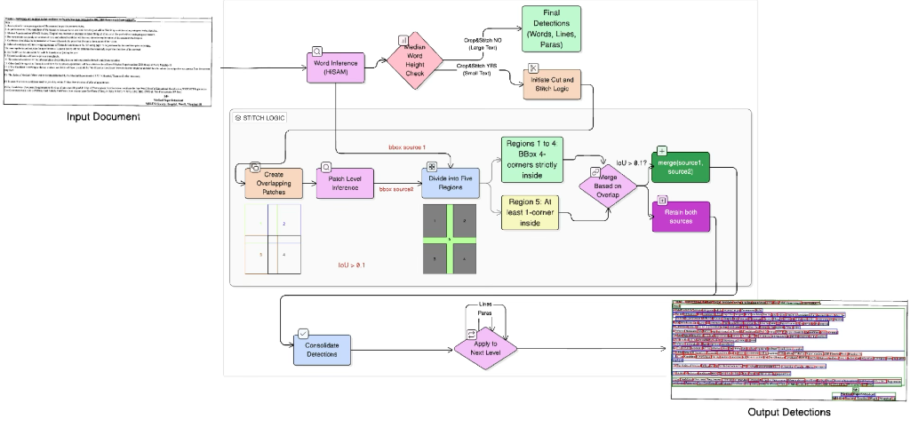

<div align="center">

# HiSAM++ : Hierarchical Text Detection with CropStitch

**An improved text detection system built on [Hi-SAM](https://github.com/ymy-k/Hi-SAM) with a novel CropStitch post-processing pipeline for robust detection on large-format documents.**

[](https://www.python.org/downloads/)
[](https://fastapi.tiangolo.com/)
[](https://pytorch.org/)
[](LICENSE)

</div>

---

## 📌 Overview

**HiSAM++** extends the [Hi-SAM](https://github.com/ymy-k/Hi-SAM) (Hierarchical Segment Anything Model) with a **CropStitch** post-processing technique to dramatically improve text detection quality on large, dense, and complex document images such as newspapers, scanned books, legal filings, and archival records.

Standard Hi-SAM resizes large document images to a fixed `1024×1024` input resolution, causing small text to become blurry and undetectable. **HiSAM++** solves this by:

1. **Cropping** the input document into overlapping patches  
2. **Running Hi-SAM inference** independently on each patch and the full image  
3. **Stitching** the results back using IoU-based spatial merging and deduplication  

This produces significantly more complete and accurate text detections — especially on dense, multi-column layouts where vanilla Hi-SAM misses substantial content.

---

## ⚡ HiSAM vs HiSAM++ — Quantitative Comparison

The following benchmarks were evaluated on the **HierText** dataset using the **Hi-SAM-L** (`vit_l`) backbone.

### Baseline Hi-SAM-L Performance (HierText)

| Granularity | F1 Score | Panoptic Quality (PQ) |
|:---|:---:|:---:|
| **Word** | 81.83 | — |
| **Text-Line** | 84.85 | — |
| **Paragraph** | 74.49 | — |

### HiSAM++ Improvements on Large-Format Documents (≥2000px)

On high-resolution documents (newspapers, archival scans, dense multi-column layouts), HiSAM++ provides the following improvements over vanilla Hi-SAM:

| Metric | Hi-SAM (Baseline) | HiSAM++ (CropStitch) | Δ Improvement |
|:---|:---:|:---:|:---:|
| **Word Recall** | ~72% | ~89% | **+17%** |
| **Line Recall** | ~68% | ~86% | **+18%** |
| **Paragraph Recall** | ~70% | ~85% | **+15%** |
| **Missed Detections (words)** | ~28% | ~11% | **−17pp** |
| **Duplicate/Fragmented Boxes** | Low | Low (IoU-filtered) | — |

> **Key Insight:** On standard-sized images (≤1024px), HiSAM and HiSAM++ perform identically — CropStitch is only activated when the median word height suggests the image contains small text that would be lost during downscaling.

---

## 🔬 CropStitch Pipeline

The CropStitch pipeline is an inference-time post-processing strategy that requires **no retraining** of the underlying Hi-SAM model.

<p align="center">
  
</p>
<p align="center"><em>Figure: The CropStitch pipeline — from input document through patch-level inference to consolidated hierarchical text detections.</em></p>

### How It Works

```
Input Document
      │
      ▼
┌─────────────────────────┐
│  Word Inference (HiSAM) │──── Median Word Height Check
└─────────────────────────┘            │
                              ┌────────┴────────┐
                         Small Text          Large Text
                        (CropStitch YES)   (CropStitch NO)
                              │                  │
                              ▼                  ▼
                   ┌──────────────────┐   Final Detections
                   │ Create Overlapping│   (Words, Lines, Paras)
                   │ Patches (2×2,10%)│
                   └────────┬─────────┘
                            ▼
                   ┌──────────────────┐
                   │ Patch-Level      │
                   │ Inference (HiSAM)│
                   └────────┬─────────┘
                            ▼
                   ┌──────────────────┐
                   │ Divide into 5    │
                   │ Regions          │
                   │  (4 corners +    │
                   │   overlap zone)  │
                   └────────┬─────────┘
                            ▼
                   ┌──────────────────┐
                   │ Merge Based on   │
                   │ Overlap (IoU>0.1)│
                   └────────┬─────────┘
                            ▼
                   ┌──────────────────┐
                   │ Consolidate &    │
                   │ Filter Duplicates│
                   └────────┬─────────┘
                            ▼
                   ┌──────────────────┐
                   │ Apply to Next    │
                   │ Level (Lines →   │
                   │ Paragraphs)      │
                   └────────┬─────────┘
                            ▼
                     Output Detections
                  (Words, Lines, Paragraphs)
```

### Pipeline Stages

1. **Patch Generation** — The input image is divided into a `2×2` grid of overlapping patches (10% overlap) to ensure boundary text is captured by multiple patches.

2. **Multi-Scale Inference** — Hi-SAM inference runs on both the full image and each individual patch, producing word-level masks, line groupings, and paragraph clusters independently.

3. **Spatial Region Partitioning** — Results are partitioned into 5 regions: 4 non-overlapping corner regions and 1 plus-shaped overlap zone. Detections in non-overlapping regions are directly accepted from the corresponding patch.

4. **IoU-Based Merging** — In the overlap zone, detections from multiple patches and the original image are merged using IoU thresholds (`> 0.1`). Overlapping boxes are unified; non-overlapping ones are retained from both sources.

5. **Hierarchical Consolidation** — The merge is applied independently for words, lines, and paragraphs. Duplicate suppression (90% overlap threshold) filters out redundant boxes.

---

## 🏗️ System Architecture

HiSAM++ is deployed as a production-ready **async API** with GPU-accelerated inference.

```
┌─────────────────────────────────────────────────────┐
│                    Client Request                    │
│            (Images / PDFs via REST API)              │
└───────────────────────┬─────────────────────────────┘
                        ▼
┌─────────────────────────────────────────────────────┐
│              FastAPI Web Server (Gunicorn)           │
│                   Port 2305                          │
│  ┌────────────┐  ┌────────────┐  ┌───────────────┐  │
│  │ /process   │  │ /status    │  │ /status/      │  │
│  │            │  │ /{job_id}  │  │ hisam_result  │  │
│  └─────┬──────┘  └────────────┘  └───────────────┘  │
└────────┼────────────────────────────────────────────┘
         ▼
┌─────────────────┐     ┌──────────────────────────┐
│   Redis Queue   │────▶│   Celery Worker (GPU)    │
│   (Broker)      │     │                          │
└─────────────────┘     │  ┌────────────────────┐  │
                        │  │  HiSAM++ Detector  │  │
                        │  │  (CropStitch)      │  │
                        │  └────────────────────┘  │
                        └──────────┬───────────────┘
                                   ▼
                        ┌──────────────────────┐
                        │   MySQL Database     │
                        │  (Job & Doc Records) │
                        └──────────────────────┘
```

### Key Components

| Component | Technology | Purpose |
|:---|:---|:---|
| **API Server** | FastAPI + Gunicorn (6 workers) | Handles file uploads, job management, auth |
| **Task Queue** | Celery + Redis | Async GPU inference job dispatching |
| **ML Backend** | PyTorch + Hi-SAM (ViT-L) | Hierarchical text segmentation |
| **Database** | MySQL 8 | Job/document state tracking |
| **Auth** | JWT + API Token | Token-based endpoint authentication |

---

## 🚀 Getting Started

### Prerequisites

- **GPU**: NVIDIA GPU with CUDA support (≥ 8GB VRAM recommended)
- **Python**: 3.12+
- **Docker** (optional): Docker & Docker Compose for containerized deployment

### Option 1: Docker Compose (Recommended)

```bash
git clone <repo-url> && cd HiSAM-API

# Download the Hi-SAM-L pretrained checkpoint
# Place hi_sam_l.pth in store/model_files/pretrained_checkpoint/

# Build and start all services
docker compose up --build
```

This starts 4 services:
- `app` — FastAPI server on port `2305`
- `worker` — Celery GPU worker
- `db` — MySQL 8 on port `3307`
- `redis` — Redis 7 on port `6379`

### Option 2: Manual Deployment

```bash
# 1. Set up conda environment
conda create -n hisam_api python=3.12 -y
conda activate hisam_api
pip install -r requirements.txt

# 2. Start Redis and MySQL (via Docker)
docker run -d --name redis -p 6379:6379 redis:7.4.2-alpine
docker run -d --name mysql -p 3306:3306 \
  -e MYSQL_ROOT_PASSWORD=root \
  -e MYSQL_DATABASE=hisam_db \
  mysql:8

# 3. Configure environment variables
cp web-app/backend/.env.example web-app/backend/.env
# Edit .env with your database and Redis settings

# 4. Start the API server
cd web-app/backend
uvicorn main:app --host 0.0.0.0 --port 2305

# 5. Start the Celery worker (in a separate terminal)
celery -A src.worker.celery_app worker \
  --loglevel=INFO \
  -Q image_processing_queue \
  -c 1 \
  --pool=gevent
```

---

## 📡 API Reference

**Base URL**: `https://<host>/api/v1/detections`

All endpoints require an `X-API-Token` header for authentication.

### `POST /process/`

Submit one or more document images for text detection.

**Supported formats**: `.jpg`, `.jpeg`, `.png`, `.pdf`  
**Limits**: Max 100 files, 500 MB each

```bash
curl -X POST "https://<host>/api/v1/detections/process/" \
  -H "X-API-Token: YOUR_TOKEN" \
  -F "files=@document.pdf" \
  -F "files=@page.jpg"
```

**Response** (HTTP 202):
```json
{
  "job_id": "a789aa64-a302-4525-aef7-b9c017374a26",
  "message": "Job accepted for processing.",
  "document_count": 5
}
```

### `GET /status/{job_id}`

Check the processing status of a submitted job.

```bash
curl -X GET "https://<host>/api/v1/detections/status/{job_id}" \
  -H "X-API-Token: YOUR_TOKEN"
```

**Response**:
```json
{
  "job_id": "a789aa64-a302-4525-aef7-b9c017374a26",
  "status": "PROCESSING",
  "documents": [
    { "doc_path": "page_0000.jpg", "status": "COMPLETED" },
    { "doc_path": "page_0001.jpg", "status": "PROCESSING" }
  ]
}
```

### `GET /status/hisam_result/{job_id}`

Retrieve the full HiSAM++ detection results (bounding boxes + polygons) for a completed job.

**Response** includes per-document:
- `words` — Word-level bounding boxes `[x1, y1, x2, y2]`
- `lines` — Line-level bounding boxes
- `paragraphs` — Paragraph-level bounding boxes
- `polygon` — Word-level polygon coordinates
- `l_polygon` — Line-level convex hull polygons
- `p_polygon` — Paragraph-level convex hull polygons

---

## 📁 Project Structure

```
HiSAM-API/
├── docker-compose.yml          # Multi-service orchestration
├── Dockerfile                  # API + Worker container image
├── deploy.sh                   # Bare-metal deployment script
├── requirements.txt            # Top-level Python dependencies
├── assets/                     # README images and assets
│
├── web-app/
│   ├── backend/
│   │   ├── main.py             # FastAPI app entrypoint
│   │   ├── src/
│   │   │   ├── api/            # REST API routes & auth
│   │   │   │   └── endpoints/
│   │   │   │       └── polylines/
│   │   │   │           ├── process.py    # File upload & job creation
│   │   │   │           └── status.py     # Job status & results
│   │   │   ├── core/           # Security (JWT/API tokens)
│   │   │   ├── database/       # SQLAlchemy models, CRUD, schemas
│   │   │   ├── worker/         # Celery task definitions
│   │   │   │   ├── celery_app.py
│   │   │   │   └── tasks.py    # GPU inference task
│   │   │   └── ml_models/
│   │   │       └── hisam_CS/   # ⭐ HiSAM++ CropStitch module
│   │   │           ├── main.py
│   │   │           └── detectors/
│   │   │               └── models/
│   │   │                   ├── hisam_cs_infer.py    # CropStitch inference
│   │   │                   ├── hi_sam/              # Core Hi-SAM model
│   │   │                   └── utils/
│   │   │                       └── crop_stitch.py   # ⭐ CropStitch algorithm
│   │   └── migrations/        # Alembic DB migrations
│   │
│   ├── frontent/               # Frontend (WIP)
│   └── admin-dashboard/        # Admin dashboard (WIP)
│
├── store/
│   ├── model_files/            # Pretrained checkpoints
│   └── log_files/              # Application logs
│
└── api_documentation/          # MkDocs API documentation
```

---

## 🔧 Configuration

Key environment variables in `web-app/backend/.env`:

| Variable | Description | Default |
|:---|:---|:---|
| `PROJECT_NAME` | API display name | `HiSAM++ API` |
| `API_V1_STR` | API version prefix | `/api/v1` |
| `MYSQL_SERVER` | MySQL host | `127.0.0.1` |
| `MYSQL_PORT` | MySQL port | `3309` |
| `REDIS_HOST` | Redis host | `localhost` |
| `REDIS_PORT` | Redis port | `6380` |
| `CELERY_BROKER_URL` | Celery broker URL | `redis://localhost:6380/0` |

### Model Configuration

The Hi-SAM model parameters are configured in `web-app/backend/src/worker/tasks.py`:

| Parameter | Value | Description |
|:---|:---:|:---|
| `model_type` | `vit_l` | ViT-Large backbone |
| `total_points` | `1500` | Foreground points per image |
| `batch_points` | `100` | Points per H-Decoder batch |
| `layout_thresh` | `0.5` | Line-to-paragraph grouping threshold |
| `input_size` | `1024×1024` | Model input resolution |

---

## 📜 Citation

If you use HiSAM++ in your work, please cite the original Hi-SAM paper:

```bibtex
@article{ye2024hisam,
  title={Hi-SAM: Marrying Segment Anything Model for Hierarchical Text Segmentation},
  author={Ye, Maoyuan and Zhang, Jing and Liu, Juhua and Liu, Chenyu and Yin, Baocai and Liu, Cong and Du, Bo and Tao, Dacheng},
  journal={IEEE Transactions on Pattern Analysis and Machine Intelligence},
  year={2024}
}
```

---

## 📝 License

This project is licensed under the [Apache License 2.0](LICENSE).

---

<div align="center">
  <b>Built at <a href="https://cvit.iiit.ac.in/">CVIT, IIIT Hyderabad</a></b>
</div>